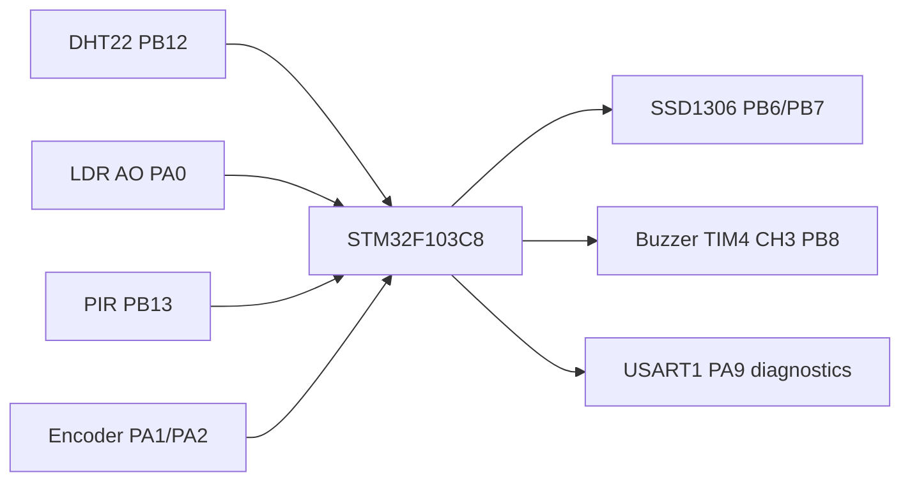
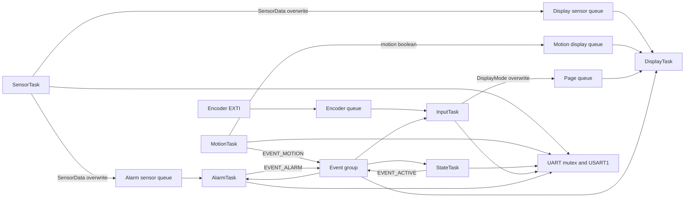
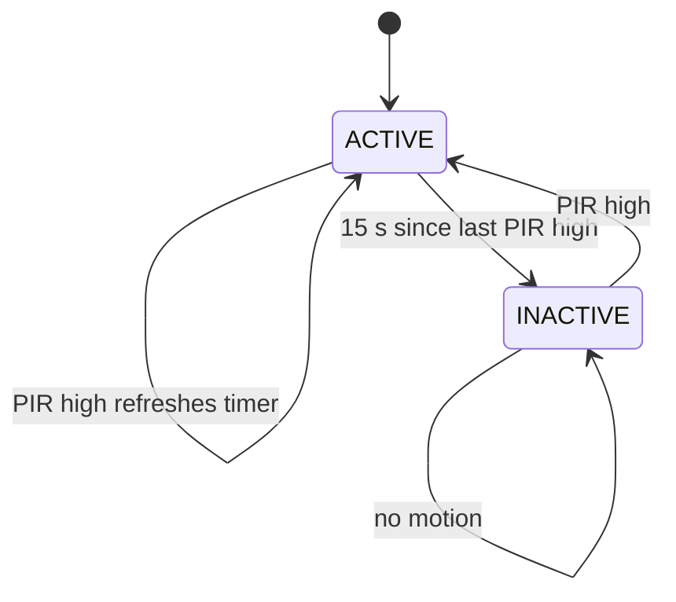
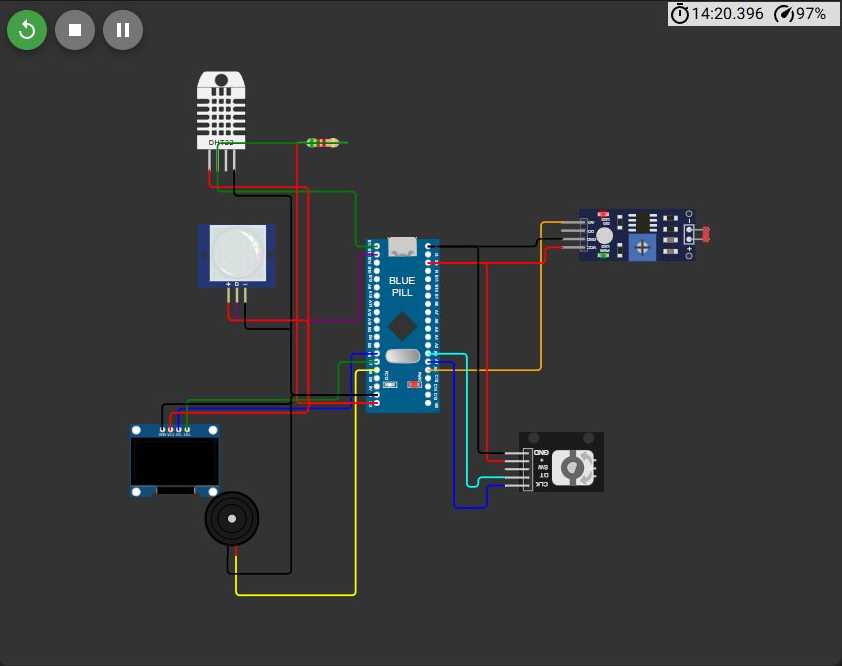
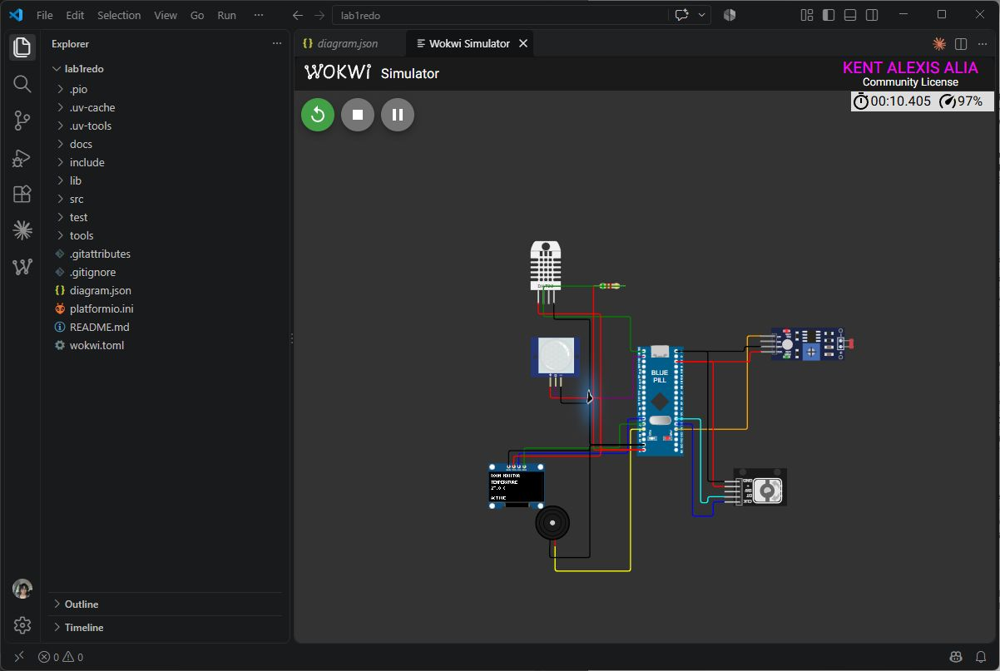
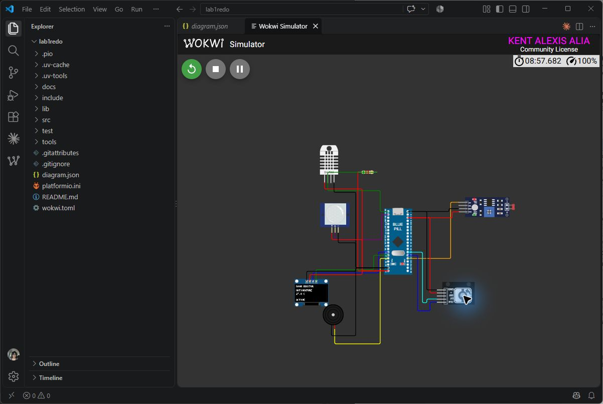

# FreeRTOS STM32 Room Multisensor

## Project Overview

A simulated STM32F103C8 Blue Pill monitors temperature, relative humidity, ambient brightness, and PIR motion. A rotary encoder selects one measurement on an SSD1306 OLED. A 500 Hz PWM buzzer sounds outside the inclusive 18-30 C temperature range. After 15 seconds without PIR activity, the OLED blanks; new motion restores it. The firmware uses STM32Cube HAL and native FreeRTOS APIs, with no Arduino framework or libraries.

The Blue Pill firmware builds and all 15 host logic tests pass. VS Code Wokwi runs verified DHT22 readings, changing LDR values, all four OLED pages, PIR activity/inactivity, and encoder page-change handling. A PB8 logic-analyzer capture shows the high-temperature alarm output at approximately 500 Hz, and a recovery capture shows the output returning low after a normal sample. The exact four-page encoder wrap sequence, a legible OLED ALARM view, and an independent acoustic check are not captured. See [the verification record](docs/verification.md) for the evidence and remaining cases.

## Features

- DHT22 temperature and humidity sampling every 2 seconds, with checksum and timeout handling.
- ADC1 light sampling converted to a relative 0-100% brightness indication. It is not calibrated lux.
- PIR motion detection, ACTIVE/INACTIVE state, and 15 second inactivity timeout.
- Four OLED pages with encoder navigation and wraparound.
- High and low temperature alarm with TIM4 PWM output.
- One-slot queues for current readings and display updates, an event group for activity/alarm state, and a mutex for UART diagnostics.

## Learning Objectives

The project demonstrates periodic scheduling, explicit priorities, task states, queue ownership, event signaling, shared UART protection, modular HAL drivers, host unit tests, and PlatformIO static analysis. [The academic report](docs/laboratory-report.pdf) explains the timing and design trade-offs.

## System Architecture



*Figure 1. Peripheral signals and their MCU pins. The editable Wokwi circuit is [diagram.json](diagram.json). See [the verification record](docs/verification.md) for live simulation observations.*

## FreeRTOS Architecture



*Figure 2. Queue copies keep independent consumers from stealing updates from one another. The event group carries level state and motion signals.*

## Hardware / Simulated Components

STM32 Blue Pill, DHT22, Wokwi photoresistor module, PIR motion sensor, KY-040 rotary encoder, 128x64 SSD1306 I2C OLED, and piezo buzzer. All sensor modules are connected to 3.3 V in the Wokwi diagram.

## Pin Configuration

| Device | Signal | STM32 pin | Driver |
| --- | --- | --- | --- |
| DHT22 | SDA | PB12 | 5.1 kΩ pull-up to 3.3 V; open-drain start, input-pull-up receive |
| LDR | AO | PA0 | ADC1 channel 0 |
| PIR | OUT | PB13 | GPIO input |
| Encoder | CLK / DT | PA1 / PA2 | EXTI1 / GPIO input |
| OLED | SCL / SDA | PB6 / PB7 | I2C1, address 0x3C |
| Buzzer | + | PB8 | TIM4 channel 3 PWM |
| Diagnostics | TX | PA9 | USART1, 115200 baud |

## Task Design

| Task | Priority | Trigger / period | Blocked condition |
| --- | ---: | --- | --- |
| MotionTask | 3 | Every 50 ms | `vTaskDelayUntil()` |
| InputTask | 3 | Encoder EXTI event | Encoder queue receive |
| StateTask | 3 | Motion event or 100 ms timeout | Event-group wait |
| SensorTask | 2 | Every 2 s | `vTaskDelayUntil()` |
| AlarmTask | 2 | Sensor update or 100 ms timeout | Alarm queue receive |
| DisplayTask | 1 | Sensor/page/motion polling, then 100 ms wait | Sensor queue; ACTIVE event while inactive |

Motion, input, and state response have the shortest latency budget. Sampling and alarm processing tolerate the bounded 2-second DHT interval. OLED transfers are slower and can run at priority 1. Each infinite task loop blocks. `vTaskDelayUntil()` anchors repeated wakeups to a fixed schedule so work duration does not accumulate as drift as it would with a plain relative `vTaskDelay()`.

## Inter-Task Communication

`SensorTask` overwrites separate one-element display and alarm queues with `SensorData {temperature, humidity, lightLevel, dhtValid}`. This prevents a consumer from removing a reading needed by another. `MotionTask` sets `EVENT_MOTION` while PIR is high and sends motion changes to the display queue. `StateTask` consumes and clears the motion event, sets or clears `EVENT_ACTIVE`, and owns the activity state. `AlarmTask` owns `EVENT_ALARM`. `InputTask` receives signed encoder directions from the ISR through an eight-item queue and overwrites the selected page queue.

`serialMutex` protects the shared USART1 transmit peripheral. Sensor, motion, input, state, and alarm tasks can log at the same time; without the mutex, byte streams from separate task calls could interleave and corrupt diagnostic lines. The display alone owns I2C1/OLED; no display mutex is needed.

## State Machine



*Figure 3. State transitions. Sensor sampling continues during INACTIVE so a fresh reading is available after reactivation; OLED rendering and the buzzer stop.*

## Repository Structure

`src/` holds task and HAL code, `include/` public firmware headers, `lib/logic/` pure decision logic, `test/` native Unity tests, `docs/` report and verification records, and `tools/` build/report scripts. `diagram.json` and `wokwi.toml` define the simulator circuit and firmware paths.

## Getting Started

Install PlatformIO Core or the VS Code PlatformIO extension, then install Wokwi for VS Code. Open this folder. STM32CubeF1 contains the FreeRTOS kernel used by `tools/freertos.py`; it compiles only the Cortex-M3 port and heap_4 allocator. No Arduino dependency is required.

## Building the Project

```sh
pio run -e bluepill_f103c8
```

The generated firmware is `.pio/build/bluepill_f103c8/firmware.bin`. Tested with PlatformIO Core 6.2.0 and ST STM32 platform 20.0.0. The production build used 21,620 B flash and 12,060 B static RAM; rerun the command for current totals.

## Running the Wokwi Simulation

Build first, then use **Wokwi: Start Simulator** in VS Code. The circuit is in `diagram.json`; the compiled binary and ELF paths are in `wokwi.toml`. Open the DHT22 sliders, LDR lux control, PIR motion popup, and encoder arrows to exercise the scenarios in `docs/verification.md`. Allow 15 seconds after PIR returns low to test inactivity. The buzzer is driven by TIM4 PWM, not a static GPIO high.

## Unit Testing

```sh
pio test -e native
```

The 15 Unity cases cover all five alarm boundaries, four navigation transitions, four state transitions, and two ADC brightness endpoints. The native target tests pure logic without requiring a physical board.

## Static Code Analysis

```sh
pio check -e bluepill_f103c8
```

The latest run reports 16 low-severity C-style-cast findings and no medium or high findings. The casts come from STM32 HAL register or FreeRTOS macro expansions at the project call sites; see the report for details.

## Functional Verification

[The verification record](docs/verification.md) lists FT-01 through FT-10 with stimuli, expected outcomes and actual observations. DHT22, LDR, OLED pages, PIR active/inactive transitions, and PWM buzzer start/recovery have live Wokwi evidence. Encoder input handling and both quadrature directions are captured; the full ordered wrap sequence remains partial. The high-temperature PWM is verified electrically at PB8, while acoustic output and a legible OLED ALARM indicator remain unconfirmed. Reversible no-delay and high-priority MotionTask faults starved lower-priority sensor output; a short UART mutex-bypass run did not reproduce interleaving. No test is marked PASS based only on compilation.

### Wokwi evidence








[Buzzer high-temperature waveform and recovery](docs/evidence/wokwi-buzzer-alarm-on.vcd) · [PIR high/low trace](docs/evidence/wokwi-pir-cycle.vcd) · [Encoder quadrature trace](docs/evidence/wokwi-input-components.vcd)

## Engineering Decisions

- Two sensor queues give display and alarm independent newest-value mailboxes. A single queue with two consumers would split readings unpredictably.
- The DHT22 transaction samples each data bit 40 us after its rising edge, between the sensor's short zero and long one pulses. The roughly 4 ms transaction runs inside a FreeRTOS critical section, so it temporarily delays lower-priority interrupts; a timer-capture design would scale better on hardware.
- The ADC percentage is inverted because the Wokwi LDR module AO voltage falls as brightness rises. It is a relative indication with no lux claim.
- TIM4 produces an audible 500 Hz square wave; a steady GPIO level would not drive a piezo buzzer properly.
- The alarm is muted in INACTIVE, following the lab's ACTIVE behavior description. Temperature evaluation resumes from current samples when activity returns.

## Limitations

Interactive Wokwi checks cover DHT22 decoding through a 45.8 C input, LDR response, all four OLED pages, task wakeups, PIR high/low and inactivity, and encoder ISR/page-change handling in both directions. The full ordered encoder wrap sequence remains partial. A PB8 VCD proves the buzzer PWM waveform starts at about 500 Hz for a high-temperature sample and stops after a normal sample. An independently measured acoustic response and a legible OLED ALARM indicator remain unverified. The no-delay and high-priority fault experiments starved sensor output; the UART mutex-bypass run did not reproduce interleaving. DHT22 sampling masks interrupts for several milliseconds. The inactivity timeout measures from the last observed PIR-high sample; the normal PIR simulation hold is five seconds. No environmental sensor calibration is attempted. DHT errors suppress the alarm rather than sounding a fault tone. Wokwi circuitry does not establish electrical suitability for physical hardware.

## Future Improvements

Capture DHT pulses with a hardware timer input capture, persist configuration in nonvolatile storage, add explicit sensor-fault indication, and measure worst-case task latency and stack high-water marks in Wokwi or on hardware.

## References and Acknowledgments

- [PlatformIO STM32Cube framework documentation](https://docs.platformio.org/en/stable/frameworks/stm32cube.html)
- [Wokwi STM32 Blue Pill support](https://docs.wokwi.com/parts/board-stm32-bluepill)
- [Wokwi simulator configuration](https://docs.wokwi.com/vscode/project-config)
- [Wokwi LDR module behavior](https://docs.wokwi.com/parts/wokwi-photoresistor-sensor)
- BCA182 Laboratory Activity 1, Mindanao State University - Iligan Institute of Technology, September 2026.
